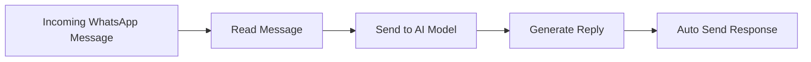

<div align="center">

# 🤖 WhatsApp AI Auto Reply Bot


<p>
  
  
  
  
</p>

</div>

---

## 📖 About The Project

🚀 An AI-powered WhatsApp automation bot that reads incoming messages, generates intelligent responses using Large Language Models (LLMs), and automatically sends replies.

This project combines Python automation with Generative AI to create a smart messaging assistant capable of handling conversations efficiently.

---

## ✨ Features

- 💬 Automatic WhatsApp message detection
- 🤖 AI-generated smart replies
- ⚡ Fast response generation
- 🔄 Continuous monitoring
- 🧠 Context-aware conversations
- 🖥️ WhatsApp Web support
- 🔐 Secure API key handling

---

## 🛠️ Tech Stack

| Technology | Usage |
|------------|--------|
| 🐍 Python | Core Development |
| 🤖 Groq   | AI Response Generation |
| 🖱️ PyAutoGUI | Automation |
| 📋 Pyperclip | Clipboard Management |
| 🌐 WhatsApp  Messaging Platform |

---

## 📂 Project Structure

```text
WhatsApp-AI-AutoReply-Bot/
│
├── main.py
├── requirements.txt
├── .env
├── README.md
└── screenshots/
```

---

## ⚙️ Installation

### Clone Repository

```bash
git clone https://github.com/vikas072/WhatsApp-AI-AutoReply-Bot.git
cd WhatsApp-AI-AutoReply-Bot
```

### Install Dependencies

```bash
pip install -r requirements.txt
```

### Configure Environment Variables

Create a `.env` file:

```env
GROQ_API_KEY=your_api_key_here
```

### Run

```bash
python main.py
```

---

## 🎯 How It Works



---

## 📸 Demo

### WhatsApp Message Processing and AI Reply Generation


 
## 🚧 Future Improvements

- 📱 Multi-platform support
- 🎙️ Voice message handling
- 🌍 Multilingual conversations
- 🧠 Conversation memory
- ☁️ Cloud deployment

---

## ⚠️ Disclaimer

This project is created for educational and learning purposes only.

Users should comply with WhatsApp's Terms of Service while using automation tools.

---

## 👨‍💻 Developer

### Vikas Yadav

🎓 B.Tech CSE (Artificial Intelligence)

🌱 Learning DSA, AI/ML & Software Development

🔗 GitHub: https://github.com/vikas072

---

<div align="center">

### ⭐ If you like this project, give it a star!


</div>
